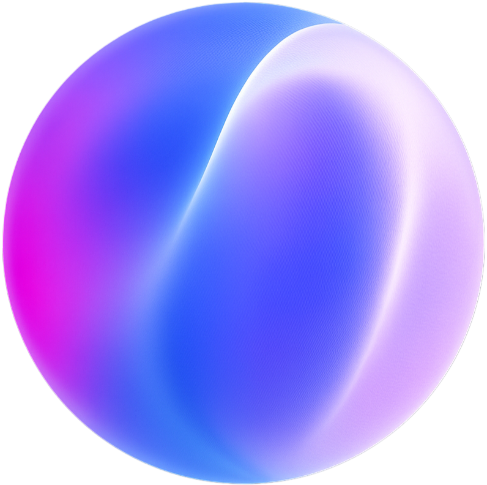

<div align="center">

```typescript
const sehind = {
    location: "Kurdistan",
    education: "Civil Engineering @ University",
    experience: "4+ years",
    focus: ["AI/ML", "Mobile Dev", "Full-Stack", "Agentic Systems"],
    passion: "Building tools that help developers build faster"
};
```

<br/>

<a href="https://twitter.com/sehindhemzani">
  
</a>
&nbsp;
<a href="mailto:sahindhamzani@gmail.com">
  
</a>

</div>

---

## About Me

I'm a **19-year-old founder** with **4+ years of coding experience**. I build AI-powered products that reach thousands of users. I've had a successful acquisition and multiple apps on the App Store.

**What I do:**
- Build production mobile apps with React Native & Expo
- Create AI-powered code generation tools & sandboxed environments
- Develop agentic systems, autonomous AI workflows & visual programming platforms
- Architect full-stack systems from infrastructure to App Store deployment

---

## Featured Projects

<table>
<tr>
<td width="50%" valign="top">

<p align="center">
  
</p>

<h3 align="center">VibraCode</h3>

<p align="center"><strong>AI Mobile App Builder</strong></p>

<p align="center">
  
  
  
  
</p>

<p align="center">
Describe your app → Get production-ready React Native code with real-time preview and instant deployment.
</p>

<p align="center">
  <a href="https://apps.apple.com/us/app/vibra-code-ai-app-builder/id6752743077">
    
  </a>
</p>

</td>
<td width="50%" valign="top">

<p align="center">
  
</p>

<h3 align="center">Fergeh</h3>

<p align="center"><strong>#1 Study App in Kurdistan</strong></p>

<p align="center">
  
  
  
  
</p>

<p align="center">
AI-powered study platform helping thousands of students learn smarter with personalized tools.
</p>

<p align="center">
  <a href="https://apps.apple.com/us/app/fergeh/id6748969353">
    
  </a>
</p>

</td>
</tr>
</table>

<br/>

<div align="center">

<h3>
  
  NodeFlow AI
  &nbsp;
  
</h3>

**Visual AI Workflow Builder** — Node-based platform for building AI automations


<br/><br/>

<a href="https://nodeflowai.com">
  
</a>

</div>

---

## GitHub Activity

<div align="center">

<picture>
  <source media="(prefers-color-scheme: dark)" srcset="https://github-readme-streak-stats-eight.vercel.app?user=sa4hnd&theme=tokyonight&hide_border=true&border_radius=10&date_format=M%20j%5B%2C%20Y%5D&mode=weekly&card_width=500"/>
  
</picture>

<br/><br/>


</div>

---

## Tech Stack

<div align="center">

**Languages**


**Frontend & Mobile**


**Backend & APIs**


**Databases & Caching**


**AI & LLM**


**Payments & Monetization**


**DevOps & Infrastructure**


**Auth & Services**


**Security & Testing**


</div>

---

## Achievements

<div align="center">

| | |
|:---:|:---|
|  | Built **VibraCode** — AI platform generating production mobile apps |
|  | Launched **Fergeh** — #1 study app in Kurdistan |
|  | **NodeFlow AI** — Successfully acquired |
|  | Years building & shipping products |
|  | Years old — Just getting started |

</div>

---

<div align="center">

**Let's build something together**

<a href="mailto:sahindhamzani@gmail.com">
  
</a>
&nbsp;
<a href="https://twitter.com/sehindhemzani">
  
</a>

</div>


